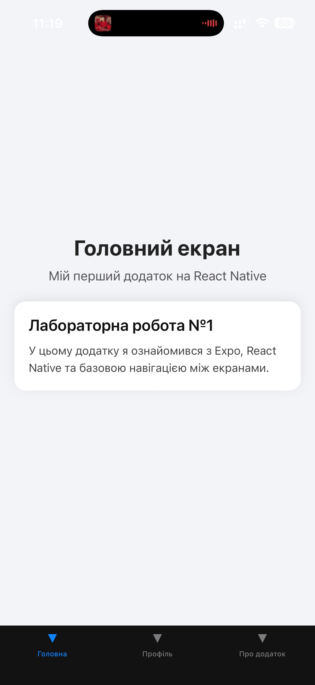
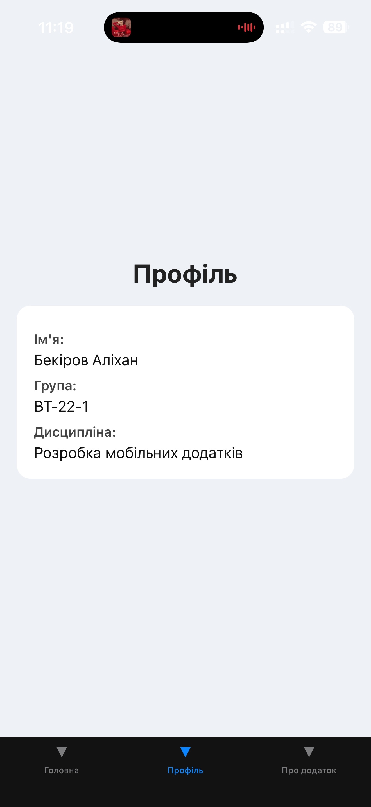
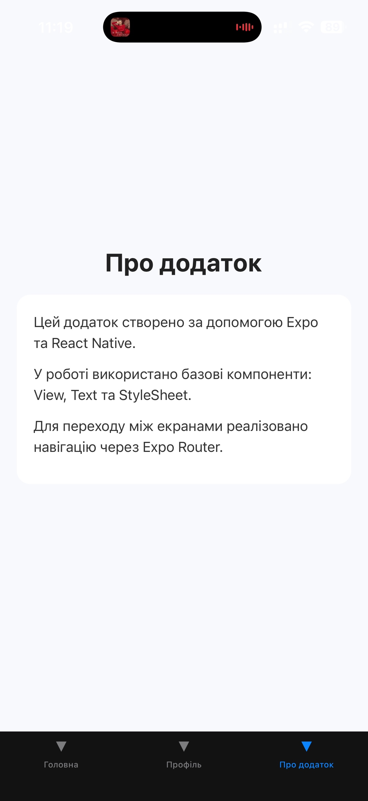

# 📱 MobileLabsRN2026 – Lab 1

## 📌 Тема

Використання Expo для створення найпростішого додатку React
Native. Знайомство з основними компонентами
---

## 🎯 Мета роботи

Навчитися створювати та налаштовувати проєкт у середовищі
Expo, ознайомитися зі структурою React Native застосунку та опанувати
навички роботи з базовими компонентами.

---

## 🛠️ Використані технології

* React Native
* Expo
* Expo Router
* JavaScript / TypeScript

---

## 📂 Структура проєкту

```
lab1/
├── app/
│   ├── index.tsx
│   └── (tabs)/
│       ├── index.tsx
│       ├── index.tsx
│       ├── profile.tsx
│       └── about.tsx
├── assets/
├── components/
├── package.json
├── app.json
```

---

## 📱 Опис додатку

Додаток складається з трьох екранів:

### 🏠 Головний екран (Home)

* Відображає інформацію про лабораторну роботу
* Містить опис проєкту

### 👤 Профіль (Profile)

* Містить інформацію про користувача
* Демонструє роботу компонентів Text та View

### ℹ️ Про додаток (About)

* Описує використані технології
* Пояснює принцип роботи додатку

---

## 🔄 Навігація

У додатку реалізована нижня навігація (Tabs), яка дозволяє перемикатися між екранами:

* Home
* Profile
* About

Навігація реалізована за допомогою **Expo Router**.

---

## ▶️ Інструкція запуску

### 1. Встановити залежності

```
npm install
```

### 2. Запустити проєкт

```
npm start
```

---

## 📲 Способи запуску

### 🔹 1. Через Expo Go (рекомендовано)

* Встановити Expo Go на телефон
* Відсканувати QR-код
* Додаток відкриється на телефоні

### 🔹 2. Android емулятор

* Запустити емулятор
* Натиснути "a" у терміналі

### 🔹 3. Web-версія

* Натиснути "w" у терміналі
* Додаток відкриється у браузері

---

## 📸 Скріншоти


* Головного екрана

* Профілю

* Екрана "Про додаток"

---

## 📖 Висновок

У ході виконання лабораторної роботи було:

* створено мобільний додаток за допомогою Expo
* реалізовано декілька екранів
* налаштовано навігацію між екранами
* отримано базові навички роботи з React Native

---

