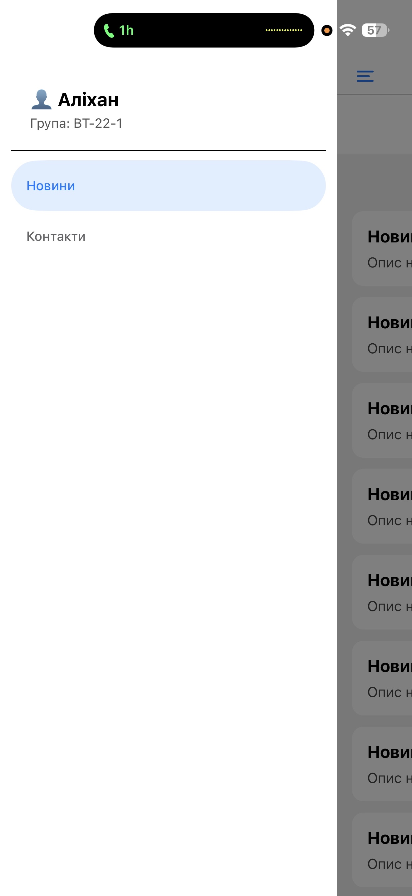
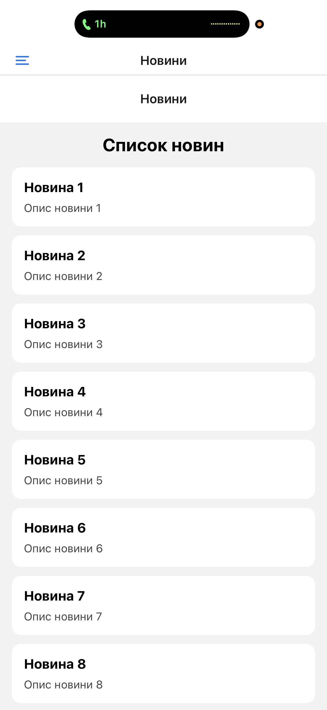
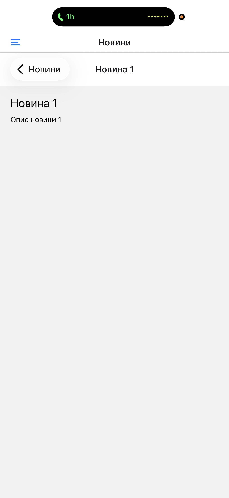
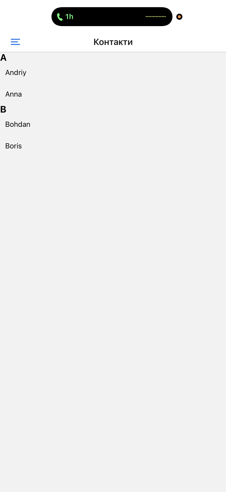

# 📱 MobileLabsRN2026 – Lab 2

## 📌 Тема

Побудова вкладеної навігації та оптимізація відображення великих
списків у React Native із використанням компонентів FlatList та
SectionList.

---

## 🎯 Мета роботи

* ознайомлення з принципами навігації у мобільних застосунках React
  Native;
* вивчення архітектури вкладеної навігації;
* набуття практичних навичок використання Drawer Navigator та Stack
  Navigator;
* засвоєння методів передачі параметрів між екранами;
* опанування ефективного відображення великих наборів даних;
* вивчення механізму віртуалізації списків
* практичне застосування компонентів FlatList та SectionList;
* формування навичок оптимізації продуктивності мобільних застосунків

---

## 🛠️ Використані технології

* React Native
* Expo
* Expo Router
* TypeScript
* FlatList
* SectionList

---

## 📂 Структура проєкту

```
lab2/
├── app/
│   ├── index.tsx           ← Drawer (бокове меню)
│   ├── contacts.tsx          ← SectionList (контакти)
│   └── news/
│       ├── index.tsx       ← Stack (вкладена навігація)
│       ├── index.tsx         ← список новин (FlatList)
│       └── details.tsx       ← деталі новини
├── components/
│   └── CustomDrawer.tsx
├── assets/
├── package.json
├── app.json
```

---

## 📱 Опис додатку

Додаток складається з двох основних розділів:

### 📰 Новини (News)

* Реалізовано список новин за допомогою FlatList
* Підтримується:

   * Pull-to-Refresh
   * Infinite Scroll (підвантаження нових елементів)
* Реалізовано:

   * ListHeaderComponent
   * ListFooterComponent
   * ItemSeparatorComponent
* Оптимізація:

   * initialNumToRender
   * maxToRenderPerBatch
   * windowSize

### 📄 Деталі новини (Details)

* Відображає інформацію про вибрану новину
* Реалізована передача параметрів між екранами
* Динамічний заголовок (title залежить від новини)

---

### 👥 Контакти (Contacts)

* Реалізовано за допомогою SectionList
* Дані згруповані по секціях
* Використано:

   * sections
   * renderItem
   * renderSectionHeader
   * keyExtractor
   * ItemSeparatorComponent

---

## 🔄 Навігація

У додатку реалізовано вкладену навігацію:

* Drawer Navigator (бокове меню)

   * Новини
   * Контакти
* Stack Navigator (всередині Новин)

   * Список новин
   * Деталі новини

---

## 🎨 Кастомізація Drawer

Реалізовано власне бокове меню, яке містить:

* Аватар (іконка)
* Ім’я користувача
* Групу
* Пункти меню:

   * Новини
   * Контакти

---

## ▶️ Інструкція запуску

### 1. Встановити залежності

```
npm install
```

### 2. Запустити проєкт

```
npm start
```

---

## 📲 Способи запуску

### 🔹 1. Через Expo Go (рекомендовано)

* Встановити Expo Go на телефон
* Відсканувати QR-код
* Додаток відкриється на телефоні

### 🔹 2. Android емулятор

* Запустити емулятор
* Натиснути "a" у терміналі

### 🔹 3. Web-версія

* Натиснути "w" у терміналі
* Додаток відкриється у браузері

---

## 📸 Скріншоти

* Drawer меню

* Список новин

* Деталі новини

* Екран контактів

---

## 📖 Висновок

У ході виконання лабораторної роботи було:

* реалізовано вкладену навігацію (Drawer + Stack)
* створено ефективний список новин за допомогою FlatList
* реалізовано динамічне підвантаження даних
* використано SectionList для групованих даних
* освоєно механізм віртуалізації списків
* реалізовано передачу параметрів між екранами

---

