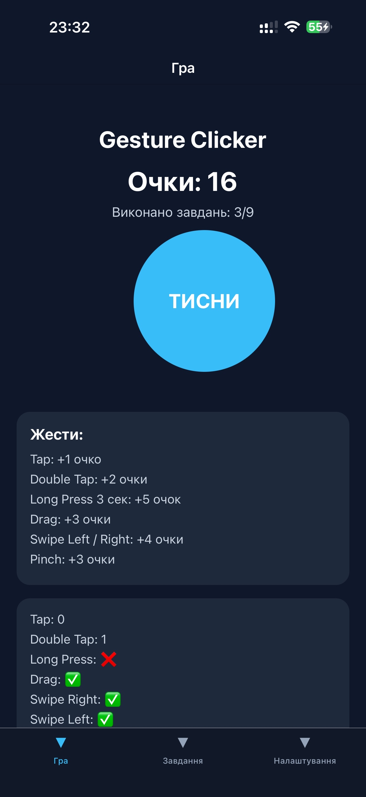
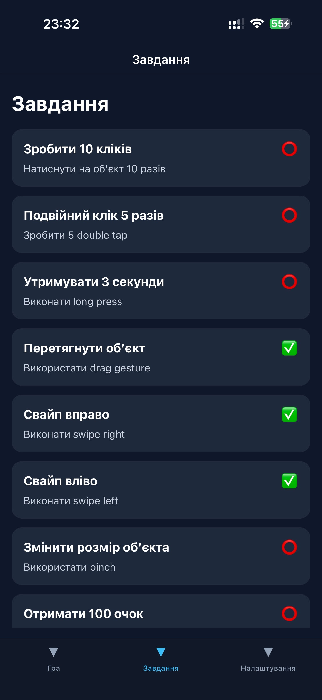
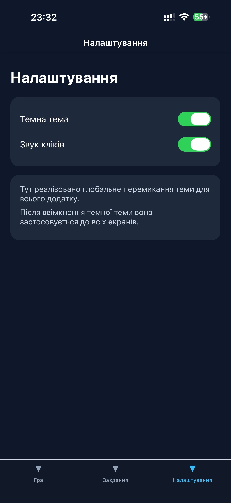
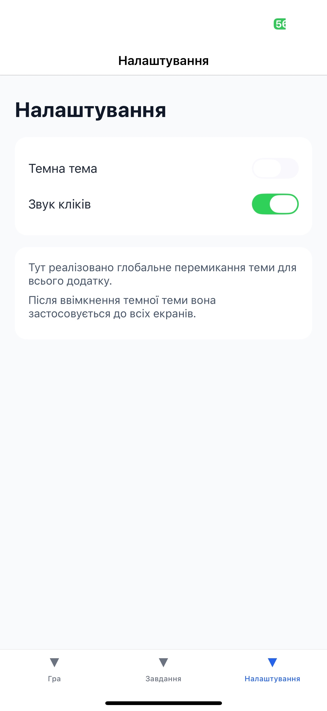

# 📱 MobileLabsRN2026 – Lab 3

## 📌 Тема

Використання кастомних жестів у React Native та стилізація
інтерфейсу мобільного застосунку.

---

## 🎯 Мета роботи

Навчитися працювати з жестами користувача у мобільному
застосунку, реалізувати взаємодію через різні типи жестів та застосувати
сучасні підходи стилізації у React Native.

---

## 🛠️ Використані технології

* React Native
* Expo
* Expo Router
* TypeScript
* react-native-gesture-handler
* Context API

---

## 📂 Структура проєкту

```
lab3/
├── app/
│   ├── register.tsx
│   ├── register.tsx
│   ├── _layout.tsx
│   └── settings.tsx
├── context/
│   ├── ThemeContext.tsx
│   └── GameContext.tsx
├── package.json
├── app.json
```

---

## 📱 Опис додатку

Додаток являє собою інтерактивну гру **Gesture Clicker**, у якій користувач взаємодіє з об’єктом за допомогою жестів.

---

## 🕹️ Реалізовані жести

| Жест             | Опис                | Очки |
| ---------------- | ------------------- | ---- |
| Tap              | Клік по об'єкту     | +1   |
| Double Tap       | Подвійний клік      | +2   |
| Long Press       | Утримання 3 секунди | +5   |
| Drag             | Перетягування       | +3   |
| Swipe Left/Right | Свайп вліво/вправо  | +4   |
| Pinch            | Масштабування       | +3   |

---

## 🧠 Логіка гри

* Користувач виконує жести
* За кожен жест отримує очки
* Ведеться підрахунок статистики
* Виконані дії відмічаються як завдання

---

## 📋 Екрани додатку

### 🏠 1. Головний екран (Game)

* Основна ігрова логіка
* Взаємодія з жестами
* Підрахунок очок
* Відображення прогресу

---

### 📊 2. Завдання (Challenges)

* Список із 9 завдань
* Автоматичне оновлення статусу (✅ / ⭕)
* Дані синхронізуються з грою

---

### ⚙️ 3. Налаштування (Settings)

* Перемикач темної теми
* Перемикач звуку
* Тема застосовується до всього додатку

---

## 🌙 Темна тема

Реалізована глобально через **ThemeContext**:

* змінюється через Settings
* застосовується до всіх екранів
* змінює кольори UI та навігації

---

## 🔄 Управління станом

Використано **Context API**:

### ThemeContext

* керує темою (light / dark)

### GameContext

* зберігає:

   * очки
   * кількість жестів
   * виконані завдання

---

## ▶️ Інструкція запуску

### 1. Встановлення залежностей

```
npm install
```

---

### 2. Запуск проєкту

```
npm start
```

---

## 📲 Способи запуску

### 🔹 Expo Go (рекомендовано)

* Встановити Expo Go
* Відсканувати QR-код

### 🔹 Android емулятор

* Натиснути `a` в терміналі

### 🔹 Web

* Натиснути `w`

---

## 📦 Додаткові залежності

```
npx expo install react-native-gesture-handler react-native-reanimated
```

---

## 📸 Скріншоти

> Додати:

* Головний екран

* Завдання

* Налаштування (світла/темна тема)


---

## 📖 Висновок

У ході виконання лабораторної роботи було:

* реалізовано інтерактивний додаток з жестами
* використано різні типи жестів
* створено систему завдань і прогресу
* реалізовано глобальний стан через Context API
* додано темну тему для всього додатку
* отримано практичний досвід роботи з React Native

---

