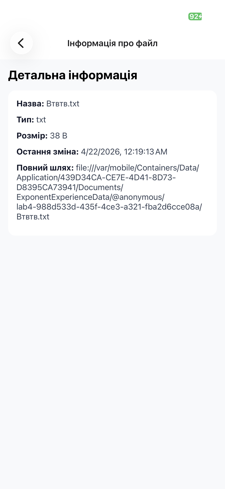

# 📱 Лабораторна робота №4

## Робота з файловою системою в React Native (Expo)

---

## 🎯 Мета роботи

Ознайомитись з можливостями роботи з файловою системою в мобільному додатку, реалізувати створення, читання, редагування та видалення файлів і папок.

---

## 🛠️ Технології

* React Native (Expo)
* Expo Router
* expo-file-system (legacy API)

---

## 📁 Структура проєкту

```
lab4/
├── app/
│   ├── _layout.tsx       # Навігація
│   ├── register.tsx         # Файловий менеджер
│   ├── editor.tsx        # Редактор файлу
│   └── info.tsx          # Інформація про файл
└── README.md
```

---

## ⚙️ Встановлення

```bash
npx create-expo-app lab4
cd lab4
npx expo install expo-file-system
npm start
```

---

## 📲 Основний функціонал

### 📂 Навігація по файловій системі

* Перегляд вмісту папок
* Перехід у вкладені директорії
* Кнопка "Вгору" для повернення

---

### 📄 Робота з файлами

* Створення `.txt` файлів
* Відкриття файлів
* Редагування тексту
* Збереження змін

---

### 📁 Робота з папками

* Створення нових папок
* Перегляд вмісту
* Видалення

---

### ❌ Видалення

* Видалення файлів і папок
* Підтвердження перед видаленням

---

### ℹ️ Інформація про файл

* Назва
* Тип
* Розмір
* Дата зміни
* Повний шлях

---

### 💾 Статистика памʼяті

* Загальний обсяг
* Вільна памʼять
* Зайнята памʼять

---

## 📸 Скріншоти





---

## ⚠️ Особливості

* Використовується `documentDirectory` для роботи з файлами
* Заборонено запис у корінь системи (`/`)
* Для сумісності використано `expo-file-system/legacy`

---

## 🧠 Висновок

У ході лабораторної роботи було реалізовано файловий менеджер, який дозволяє виконувати базові операції з файлами та папками у мобільному додатку. Було вивчено роботу з файловою системою в Expo та принципи організації даних.

---
